# Project Architecture

This document provides a comprehensive view of the project's architecture using a Mermaid diagram.

```mermaid
graph TB
    subgraph Project Structure
        Root["/"] --> SRC[src/]
        Root --> Tests[tests/]
        Root --> Scripts[scripts/]
        Root --> InitScripts[init-scripts/]
        Root --> Prometheus[prometheus/]
        Root --> GitHub[.github/]
        Root --> Docker[docker-compose.yml]
        Root --> Dockerfile[Dockerfile]
        Root --> Requirements[requirements.txt]
        Root --> README[README.md]
        Root --> Env[.env files]
        Root --> Nginx[nginx/]
        Root --> Loki[loki/]
        Root --> Promtail[promtail/]
    end

    subgraph Source Code [src/]
        SRC --> Main[main.py]
        SRC --> Config[config.py]
        SRC --> Database[database.py]
        SRC --> Models[models/]
        Models --> BaseModel[base.py]
    end

    subgraph Configuration
        Config --> AppConfig[AppConfig]
        Config --> ServerConfig[ServerConfig]
        Config --> LoggingConfig[LoggingConfig]
        Config --> DatabaseConfig[DatabaseConfig]
        Config --> RedisConfig[RedisConfig]
        Config --> SecurityConfig[SecurityConfig]
        Config --> RateLimitConfig[RateLimitConfig]
        Config --> MonitoringConfig[MonitoringConfig]
        Config --> FeatureConfig[FeatureConfig]
        Config --> PerformanceConfig[PerformanceConfig]
        Config --> BackupConfig[BackupConfig]
    end

    subgraph Database
        Database --> AsyncEngine[AsyncEngine]
        Database --> AsyncSession[AsyncSession]
        Database --> Models
        BaseModel --> CommonFields[Common Fields]
        CommonFields --> UUID[id]
        CommonFields --> Timestamps[created_at/updated_at]
        CommonFields --> Audit[created_by/updated_by]
    end

    subgraph Services
        Main --> FastAPI[FastAPI App]
        FastAPI --> Endpoints[Endpoints]
        FastAPI --> Middleware[Middleware]
        FastAPI --> MetricsEndpoint[Metrics]
        FastAPI --> HealthCheck[Health Check]
    end

    subgraph Infrastructure
        Docker --> PostgreSQL[PostgreSQL]
        Docker --> Redis[Redis]
        Docker --> PrometheusService[Prometheus]
        Docker --> GrafanaService[Grafana]
        Docker --> LokiService[Loki]
        Docker --> PromtailService[Promtail]
        Docker --> PgAdmin[PgAdmin]
        Docker --> RedisCommander[Redis Commander]
        Docker --> NginxService[Nginx]
    end

    subgraph Testing
        Tests --> ConfigTests[test_config.py]
        Tests --> DatabaseTests[test_database.py]
        Tests --> MainTests[test_main.py]
        Tests --> ModelTests[test_models.py]
    end

    %% Relationships
    Main --> Config
    Main --> Database
    Database --> Config
    Models --> Database
    FastAPI --> Database
    Tests --> SRC
```

## Component Details

### Source Code (`src/`)
- `main.py`: FastAPI application entry point
- `config.py`: Configuration management using Pydantic
- `database.py`: Database setup and session management
- `models/`: Database models and base classes

### Configuration
Multiple configuration classes for different aspects:
- Application settings
- Server configuration
- Logging settings
- Database configuration
- Security settings
- Performance tuning
- Feature flags

### Database
- Async SQLAlchemy with PostgreSQL
- Connection pooling
- Session management
- Base model with common fields
- Audit logging

### Services
FastAPI application with:
- RESTful endpoints
- Middleware configuration
- Metrics collection
- Health monitoring
- CORS and security

### Infrastructure
Docker-based deployment with:
- PostgreSQL database
- Redis caching
- Prometheus metrics
- Grafana dashboards
- Loki log aggregation
- Nginx reverse proxy

### Testing
Comprehensive test suite covering:
- Configuration management
- Database operations
- API endpoints
- Model functionality 